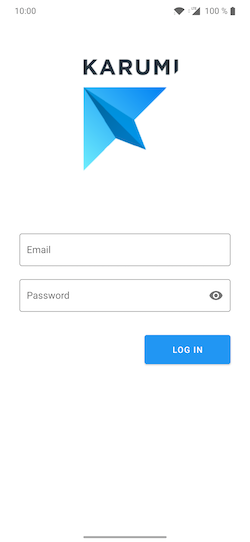
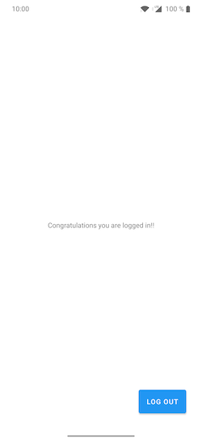

# Borja González Code Test

## UI

It's created using material components with gesture navigation enabled.

  
  

## Architecture

The project uses an implementation of the clean architecture, this implementation uses three layer architecture with different patterns in each layer.
 
 -  PresentationLayer: MVP is used in this layer to reduce the responsibility of the view and to ease the testing.
 -  Data layer makes use of the Repository pattern to encapsulate the logic of each data source, it also improves a lot the readability of the data access.
    
I've chosen to use dagger together with hilt for dependency injection, it allows an easy graph dependency swap in tests.

At last, I have added a library called Result to deal with errors. I strongly believe that errors must be part of the return of the function, this allows to the consumer to know all the possible exits that the functions may have.  


## Test

This repository makes use of different test aproaches.

  - Unit testing: this tests allows to test small chuncks of code without taking into account the dependencies, this tests are used to check presenter's behaviour.
  - UI tests: this tests allows to test the app is behaving as it is designed.  Replacing the repository to a fake one we can test the app in all the possibles scenarios and check is behaving according to the expectations.

## Usage 

How to execute (you will need an emulator or a device with debug mode connected)
````bash
./gradlew installDebug
````

How to test
````bash
./gradlew check
./gradlew executeScreenshotTests
````